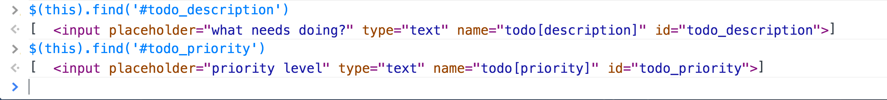
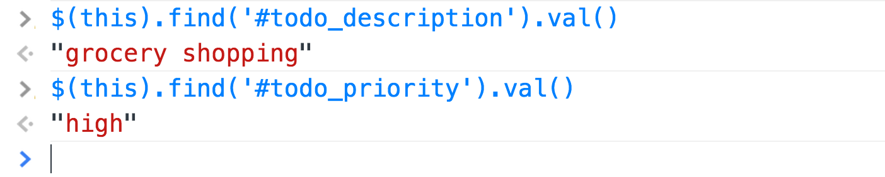
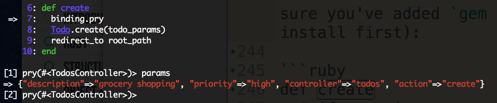
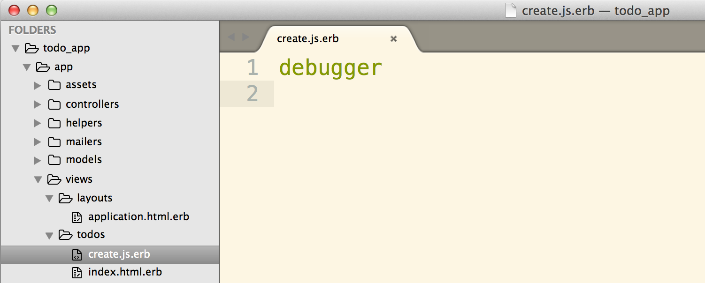
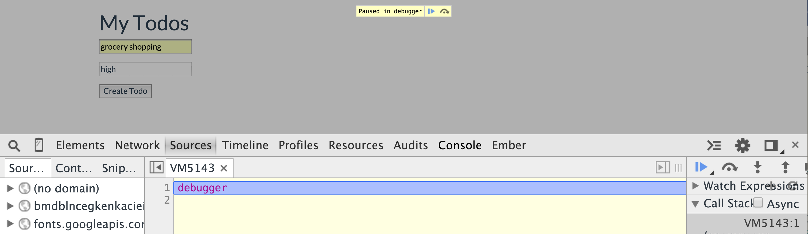

# Simple Todo List With Ajax

## Description

This readme will walk you through the process of adding Ajax to a very simple rails todo list app. Instead of using `remote: true`, we'll be writing out our own jQuery Ajax requests and go through the whole process step by step. By the end of this tutorial, here's the functionality we'll have:

<!-- INSERT DEMO HERE -->

## The Basic Rails Todo App

Before getting to Ajax, here are the steps that created the basic rails todo app we'll be building on:

1. `rails new todo_app`
2. `rails g resource todo`
3. In the migration file (located in `db/migrate`):

```ruby
class CreateTodos < ActiveRecord::Migration
  def change
    create_table :todos do |t|
      t.string :description
      t.string :priority
      t.timestamps null: false
    end
  end
end
```

4. In `app/controllers/todos_controller.rb`:

```ruby
class TodosController < ApplicationController
  def index
    @todos = Todo.all
  end

  def create
    Todo.create(todo_params)
    redirect_to root_path
  end

  def destroy
    todo = Todo.find(params[:id])
    todo.destroy
    redirect_to root_path
  end

  private
    def todo_params
      params.require(:todo).permit(:description, :priority)
    end
end
```

5. In `config/routes.rb`:

```ruby
Rails.application.routes.draw do
  root 'todos#index'
  resources :todos
end
```

6. Create `views/todos/index.html.erb` with a basic form and list of todos:

```ruby
<h1>My Todos</h1>

<%= form_for Todo.new do |f| %>
  <div class="form-group">
    <%= f.text_field :description, placeholder: 
    "what needs doing?" %>
  </div>

  <div class="form-group">
    <%= f.text_field :priority, placeholder: "priority level" %>
  </div>

  <div class="form-group">
  <%= f.submit %>
  </div>
<% end %>

<ul>
<% @todos.each do |todo| %>
  <li>
    <%= todo.description %><br>
    <strong>priority: </strong><%= todo.priority %><br>
    <%= link_to "done", todo_path(todo), method: 'delete' %>
  </li>
<% end %>
</ul>
```

7. Before starting up the rails server: `rake db:migrate`.

Now we can create new todos and destroy them. This is as functional as our app needs to be. Except for one thing. Since this is a single page app, it would be really nice if we could add and remove todos without refreshing the page. Enter Ajax!

## Adding Ajax

### Posting a new Todo with Ajax

First we are going to "ajaxify" the process of creating todos. Since we are entering JavaScript land, we'll go into `app/assets/javascripts`. You'll see a file called `todos.coffee` or `todos.js.coffee`. We will not be using CoffeeScript, so rename it to `todos.js`. 

Here's what we are going to implement:

When the "Create Todo" button is clicked, we will stop the default form submission behavior from happening, and send an Ajax request instead. To break this down further, here are the steps we'll need to follow:

1. Create an event listener for the 'click' event.
2. Grab some information from the form to use in our Ajax request.
3. Make the Ajax request.
4. Handle the response and add the new todo to the page.

#### Create an Event Listener
In `app/assets/javascripts/todos.js`:

1. Make sure the document is ready before doing anything else.
```javascript
// This is shorthand for $( document ).ready(function() { })
$(function(){
  
})
```

2. Listen for the submission of the form.
```javascript
$(function(){
  $("form").submit(function(){
    // this debugger should be hit when you click the submit button!
    debugger
  })
})
```

3. Prevent the default behavior (the form submitting and the page reloading).
```javascript
$(function(){
  $("form").submit(function(event){
    event.preventDefault();

    // this debugger should be hit when you click the submit button!
    debugger
  })
})
```

#### Grab Information From the Form
In order to make the Ajax request, we'll need to give the request the correct action and method to take us to the create action in the todos controller. If we `rake routes`, we'll see this:

`POST   /todos(.:format)          todos#create`

So we know we will be making a 'post' request to '/todos'. We could hard code this in our Ajax request, but what if our routes change later on? Our request would no longer work. In order to make our code more robust, we'll get the correct action and method directly from the form itself. Basicaly, we'll ask the form where it was going by extracting the information with jQuery.

The `debugger` we threw into our code above will be really useful in figuring out the jQuery code for pulling out the information we need. With your server running and your JavaScript console open, fill in the form and hit the submit button. When the debugger gets hit, what is `this`?


Since our debugger is inside the function that's attached to the form submission, `this` is the form itself! And the action and method we need are right there. Let's use jQuery to grab them, using the handy jQuery [.attr() method](https://api.jquery.com/attr/).


```javascript
$(function(){
  $("form").submit(function(event){
    event.preventDefault();

    var action = $(this).attr('action');
    var method = $(this).attr('method');

  })
})
```

Of course, we also need the text we entered into the form for the todo description and priority level. If we open up the form element and all the divs that live inside of it in our console, we see that Rails gave our inputs some nice ids that we can use to select them with. Specifically, there's an input with an id of "todo_description" and an input with an id of "todo_priority". Lets grab these using the jQuery [.find()](https://api.jquery.com/find/) method.



We don't see the values that we typed into the form yet, but we can pull them out using the jQuery [.val()](https://api.jquery.com/val/) method.



Great! Let's store these values as variables so we can pass them in to our Ajax request.

```javascript
$(function(){
  $("form").submit(function(event){
    event.preventDefault();

    var action = $(this).attr('action');
    var method = $(this).attr('method');

    var description = $(this).find('#todo_description').val();
    var priority = $(this).find('#todo_priority').val();

  })
})
```
We are ready for the next step!

#### Make the Ajax Request
We are going to make an Ajax request that will deliver a JavaScript response to the create action in the todos controller.

The [jQuery documentation for writing Ajax requests](http://api.jquery.com/jquery.ajax/) is really nice, so here's some code I pulled from there:

```javascript
$.ajax({
  method: "POST",
  url: "some.php",
  data: { name: "John", location: "Boston" }
})
```

If we change the method, url, and data to the variables we created, we should be good to go! Our todos.js should now look like this:

```javascript
$(function(){
  $("form").submit(function(event){
    event.preventDefault();

    var action = $(this).attr('action');
    var method = $(this).attr('method');

    var description = $(this).find('#todo_description').val();
    var priority = $(this).find('#todo_priority').val();

    $.ajax({
      method: method,
      url: action,
      data: { description: description, priority: priority }
    })

  })
})

```

Since we're expecting this Ajax request to hit the create action in the todos controller, let's put a `binding.pry` in there (make sure you've added `gem 'pry'` to your Gemfile and run bundle install first):

```ruby
def create
  # if our ajax request works, we'll hit this binding at take a look at params!
  binding.pry
  Todo.create(todo_params)
  redirect_to root_path
end
```

Here's what you'll see when that binding gets hit:



Success! The Ajax request went where we wanted it to go and it sent the params through the way we told it to. But params is not quite right. Since we're using strong params, we need a nested structure where "todo" is a top level key. By changing our Ajax request to include `data: { todo: {description: description, priority: priority} }`, this problem is solved and we're ready for the next step.


#### Handle the Response

We're still in the todos controller create action, and we're now able to instantiate new todos using the nicely structured params that we sent via Ajax. Currently, after creating the new Todo, we are just redirecting to the root_path. But the whole point of using Ajax is *not* to redirect. By default, a rails controller action handles responses that are sent in as html strings. We now want to tell it to respond to JavaScript:

```ruby
def create
  Todo.create(todo_params)
  
  respond_to do |format|
    # if the response fomat is html, redirect as usual
    format.html { redirect_to root_path }

    # if the response format is javascript, do something else...
    format.js { }
  end
end
```

Before going further into what Rails will do with this JavaScript response, there's one more problem with our Ajax request. We did not tell it to send back JavaScript! Let's do that now, and our Ajax call should look like this:

```javascript
$.ajax({
  method: method,
  url: action,
  data: { todo: {description: description, priority: priority} },

  // this line makes the response format JavaScript and not html.
  dataType: 'script'
})
```

So now that we're getting the response we want, what is `format.js { }` actually doing?

When Rails sees that line of code, it will automatically look for a file with the path `app/views/<controller name>/<action name>.js.erb`. In our example, it's looking for app/views/todos/create.js.erb.

Make that file and throw a debugger in there to confirm that it's actually where we land when we get out of the create action.




### Deleting a Todo with Ajax

## Resources

- [jQuery Documentation - jQuery.ajax()](http://api.jquery.com/jquery.ajax/)
- [Learning About Ajax](http://blog.flatironschool.com/post/56146220219/learning-about-ajax)
